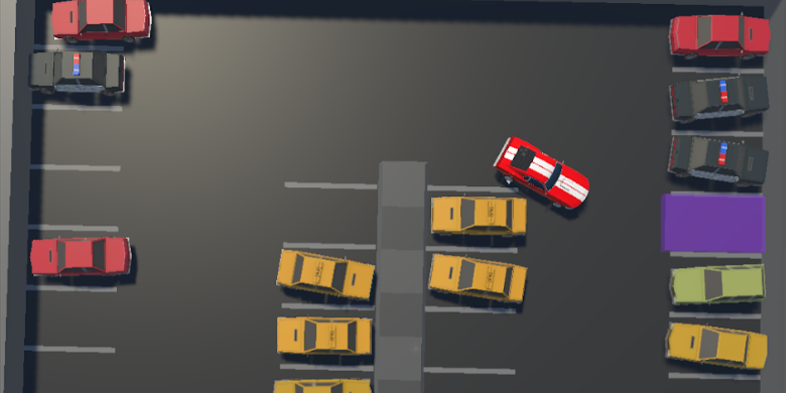

# Applying Reinforcement Learning To Self-Learning Cars

The visualisation of the simulation may be found [here](https://www.youtube.com/watch?v=lFDOppuIpV4&feature=youtu.be).

Reinforcement learning is a field of machine learning which deals with "living environments" by exploitation and exploration. It is a concept that requires a high precision with adjusting parameters and the difference of the environment makes one need to tune the parameters.

The assumption of this thesis is to design environments that agents can train on to park by themselves using reinforcement learning and observe the influence of parameters on the agents' behaviour by tuning them accordingly.

Two environments were modeled - one non-complex and one complex in order to easily find the proper parameters on the first one and then test them and tune them on the other one. In Unity engine a parking system was programmed that generated the obstacle cars, the agent and the target space. The first simulations were not effective but after tuning especially reward system after every run, the results were significantly better every time.

After that the simulations were performed on the same parking lot but with a random spawning point and initial rotation. Then the agent started the training on the complex en- vironment and in the end the random spawning point and initial rotation were also turned on. At the beginning the results of the effectiveness were poor but at the end the results were over 90%. On the non-complex environment the agent took about 3 hours to achieve such result but in the complex one it did got to barely over 30% in 21 hours. Even worse effect could be seen in case of adding the randomness where the similar level were achieved after 40 hours.

Such results expose the effects of environment diversity in reinforcement learning. Adjusting the parameters and the reward system is significant regarding the outcome. Every time adding more randomness to the environment make the process of training much longer.
 

## To train

If you want to start training you have to install ml-agents, pycharm and create a virtual machine in the project folder acccording to [this](https://www.youtube.com/watch?v=zPFU30tbyKs&ab_channel=CodeMonkey) tutorial. 

Then you should consider building the game and operate on the build without an aspect of graphics' generation. After accessing the virtual machine from CMD the command is more or less:
**mlagents-learn config/<configFile> --run-id="<nameOfRun>" --num-envs=5 -- env=Builds --no-graphics** <- "Builds" reffers to name of the folder where the Build is stored.

## Features

- Unity ML-Agents Toolkit,
- Pycharm,
- Proximal Policy Optimization.

## Additional Resources
[PROMETEO: Car Controller](https://assetstore.unity.com/packages/tools/physics/prometeo-car-controller-209444) by Mena,
[Simple Cars Pack](https://assetstore.unity.com/packages/3d/vehicles/land/simple-cars-pack-97669) by MyxerMan,
[Unity ML-Agents Toolkit](https://github.com/Unity-Technologies/ml-agents) by maryamhonari.
